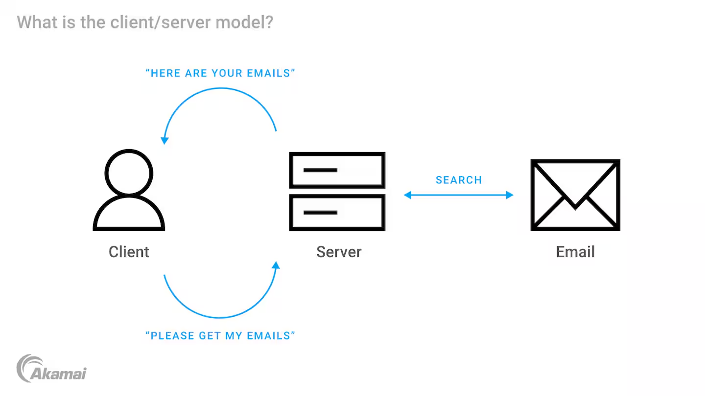
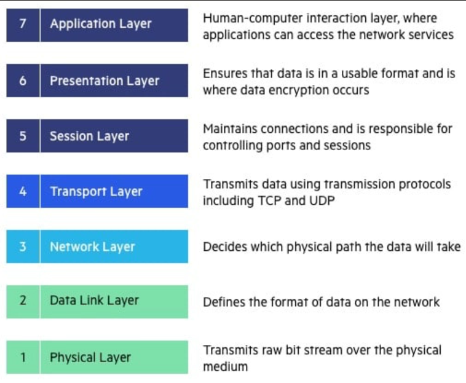
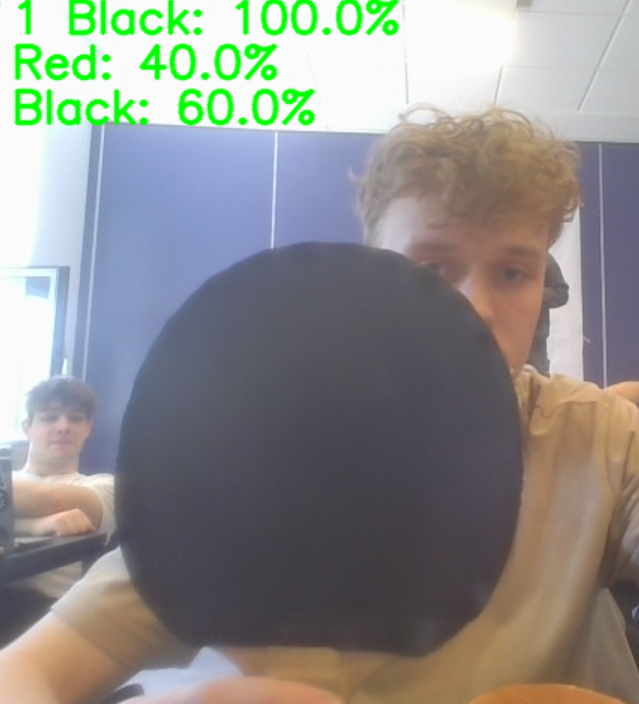
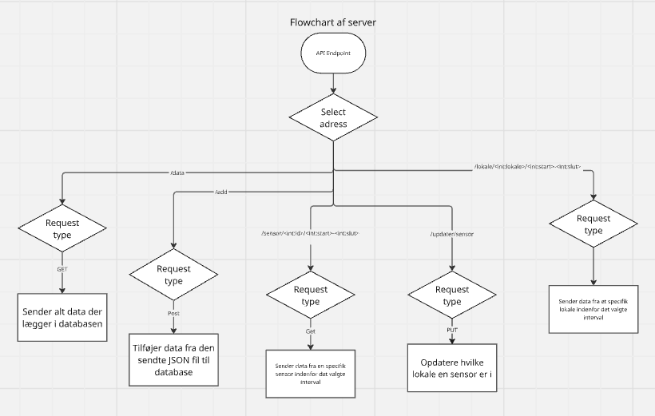
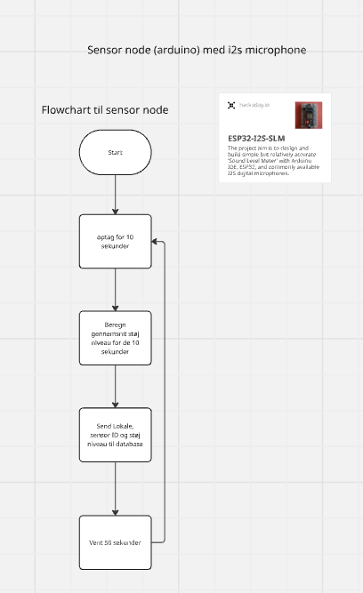
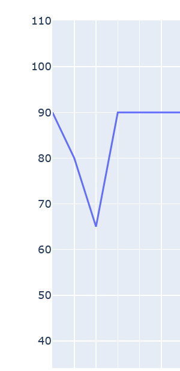
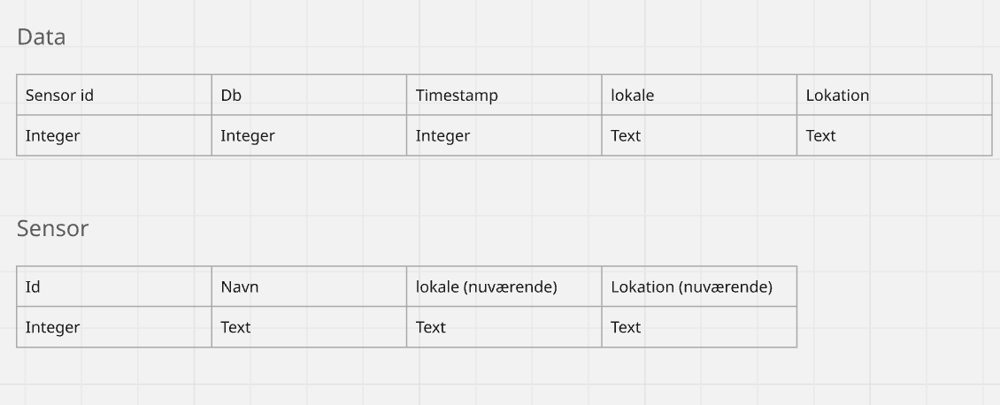
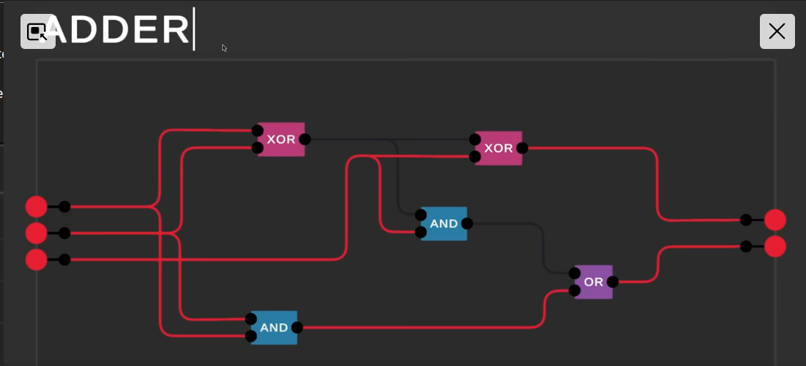
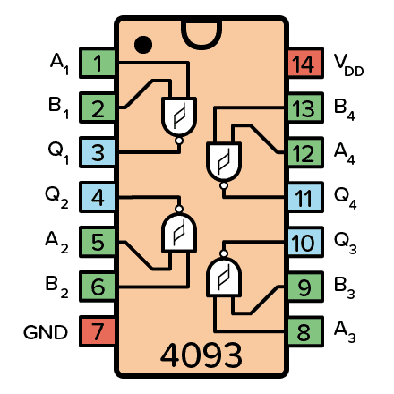

# 1. forløb tello drone

Link til github projekt (har logbog for de andre dage): https://github.com/Ag-chr/Drone_controller
### tre lags model
- Analyse af Tellodronen som it system

  - Lag 1: Præsentationslaget:
    Brugen programer dronen til at udøver nogen komandoer eller bruger appen til at kontroler dronen. Appen viser vigtige data som video, batteriniveau og andre vigtige oplysninger.

  - Lag 2: Logiklaget:
    Udfører komandoerne som er hentet fra præsntationslaget og bruger data fra datalaget til at udføre dem.

  - Lag 3: Datalaget:
    Datalaget opvarer data fra sensorerne og sender dem til logiklaget for beslutningtagning

## Dato: 16/08-2024

### Bruger undersøgelse
Heuristik: Hvordan mennesker tager beslutninger og udforsker og lære nye ting.
Brugens opfattelse, hvor der laves regler til hvordan brugeren opfatter det. Fx former/farver/afstande

Gestalt lovene: En måde at forstå hvorfor man kan differencer forskellige objekter og hvordan to objekter høre sammen.

### Lave videre på drone projekt
- Idegenerering til måder at kontroller Tello Dronen

  - Innovation (4p modellen)

- Brainstorm:
  1.	xbox controller
  2.	Når man klapper sker der et eller andet shit
  3.	Den letter eller lander når man råber af den
  4.	Click cookien i cookie clicker for at lave et flip
  5.	Kontroller dronen med musen (wtf?)
  6.	Keyboard shortcut til at flyve til damascus
  7.	Følger dronningens bevægelse i skak
  8.	Nok droner=et skak spil
  9.	Voice kontrol
  10.	 face rekognition så følger ansigt

# Databaser
## Dato 25-11-2024
### Databasesystem
Fra <https://informatik.systime.dk/?id=1134&L=0>

Et databasesystem består af to dele

	1. En database, der er en struktureret datamængde
	2. En grænseflade hvorigennem databasebrugere kan tilgå databasen, dvs. kan:
		- læse data i databasen
		- indsætte data i databasen
		- ændre i data i databasen
		- slette data i databasen.
		
Et godt databasesystem har en række systemkvaliteter:

	• pladseffektiv lagring: databasen er billig at lægge diskplads til,
	• fleksibelt design: databasen er let at bruge, vedligeholde og udvide,
	• data er lagret sikkert: ondsindede personer kan ikke uretmæssigt ændre databasens indhold,
	• data er korrekt: databasens indhold afspejler den virkelighed, databasen modellerer.

### Analyse
Fra <https://informatik.systime.dk/?id=1135>

	• En entitet er en enhed, der ofte er en enhed i fysisk forstand. Fx en bil, en person eller et spil.
	• En relation er en sammenkobling af to entiteter. Fx medlem ejer spil - her er ejer relationen.
	• En attribut er en egenskab ved en entitet.

### E/R-diagram
Fra <https://informatik.systime.dk/?id=1136> 

Der er tre ting i en database:

	• Entiteter
	• Relationer
	• Attributter

En måde at få overblik over entiteter og relationer.

	1. For hver entitet skrives entitetsnavnet i en kasse
	2. For hver relation skrives relationsnavnet i en diamant
	3. Den enkelte relation placeres mellem to entiteter, og der tegnes streger mellem dem.

### Relationsgrad
Relationsgraden beskriver antalsforholdet mellem relationer. 
Der er tre typer relationsgrader:

	• 1-M (en-til-mange)
	• M-M (mange-til-mange)
	• 1-1 (en-til-en)

### ER-model (god video til termer)
https://www.youtube.com/watch?v=wOD02sezmX8

### ER-model (how to draw) + cardinalities 
https://www.youtube.com/watch?v=xsg9BDiwiJE&pp=ygUKRVIgZGlhZ3JhbQ%3D%3D
https://www.youtube.com/watch?v=hktyW5Lp0Vo&t=676s

## Dato: 13-12-2024
### Server - client
En model, hvor det opdeles i client og server. Brugt til analyse og lave struktur

# Kryptering og opsec projekt
github link (som indeholder miro og trello link i readme): https://github.com/Ag-chr/SIGINT-projekt

I projektet valgte vi at lave et program, som kunne krypterer en lydfil i et billede.
Men i løbet af projektet fandt vi ud af at det var meget svært.
Derfor gik vi med at krypterer text i et billede.
Det gjorde vi med least significant bit (LSB).
Den handler om at kode et sit data ind i det mindste bit for hver farve,
da sådan et lille farveskift kan man ikke se med det blotte øje.

## Dato: 10-01-25
https://informatik.systime.dk/?id=810
### Krav til kryptering system:
	• Privathed (privacy)
		○ Ingen ved at man er den som sender
	• Fortrolighed (confidentiality)
		○ Den besked man sender til en bliver kun set af den som man sender til.
	• Integritet (Intergerity)
		○ Man kan stole på at det virker
	• Uafviselighed
		○ Hvis man krypterer en besked så ved de andre at man er den som har krypteret det.
	• Sikkerhed (ligesom en rundkørsel)

Message: M
Cipher: C

Afsender og modtager er enig om nøgle

### To kategorier af kryptering:
	1. Symmetrisk (Caesar cipher). Begge skal blive enig om nøgle, hvor de er nødt til at sende det ukrypteret.
	2. Asymmetrisk
		RSA:
		Alle har en public og secret key. Kaldes for et nøglepar. Public key bliver uddelt til alle.
		pk: public key
		sk: secret key
		
		public_key(M) --> C
		Den C kan kun dekrypteres med ejerens secret key.

ob: Står for binæer

Matematikken i RSA

#### RSA keygen:
2 primtal: Kaldes p og q.

n produkt af de to primtal

n=p·q

e skal være større end n

e=3

d er en funktion som beregner noget med e, n, p, q

d=math(e,n,p,q)

Public key er: n og e

Secret key er: n og d

Mod: modulær

Når en besked sendes af en som hedder A og modtageren er B

Når A sender beskeden krypteres den med B's public key:

C_Bpk=M^(e_B )  mod n_B

Dekrypteres af B:

M=C^d  mod n

Signature: Så man kan se hvem afsenderen er. Det sendes med beskeden

Hash(M)→sign_sk (Hash→signature sendes med M

Der bruges SHA 256 til signaturen

Regning af d

λ(n): Greatest commom denomerator
d=e^(−1)  mod(λ(n))

## Dato 17-01-2025
begynder på projekt opsec/sigint

Link til github: https://github.com/Ag-chr/SIGINT-projekt

# Cybersikkerhed
## 13-03-2025
### cybermesterskaberne
Jeg var inde på cybermesterskaberne og prøvede at lave what time is it.
Jeg prøvede at lave den i en time hvor jeg blev en smule færdig med den. 
Jeg tror jeg fik lavede den rigtige nøgle noget til at få adgang til den der post /9012340-123849081239582304213-42134123 fil
, derefter sad jeg fast. Det var, fordi det var svært at finde ud af hvordan man sendte den nøgle i en json fil med POST method. (det var også på grund af jeg løb ud af GPT-4o, men same same)

chatgpt logs: [https://chatgpt.com/share/67d29a25-df94-8003-88b9-f66e293567c8]()

Efter det gik jeg hen til overthewire, da de andre opgaver på cybermesterskaber (jeg ikke allerede havde løst) var der meget få løsninger på.
### overthewire.org
Jeg begyndte med bandit, da det er lavet til begyndere og intoducerede en til ssh.

lavede level 0 ved at indtaste det rigtige port, username og webadresse. (så jeg husker, hvordan det gøres: ssh -p 2220 bandit0@bandit.labs.overthewire.org)

Lavede level 1 ved at logge ud og ind når jeg fik kodeordet til bandit1.

Lavede level 2 ved at brug hjælpen i opgaven som var at søge på dashed filenames

Lavede level 3

Lavede level 4

Lavede level 5 ved at manuelt at tjekke dem igennem.

## 27-03-2025

CVE (Common Vulnerabilities and Exposures): et nummer af et rapporterede bug

Bug bounty: penge for at finde bug i sikkerhed

Responsible discolsure: I stedet for at sælge bug til hacker for penge så giver man viden til firmaet.

UDP: sender packets uden at tjekke om modtagelse

TCP: Med hver packets skal modtageren sende en besked som sikre for modtagelse, ellers sendes den igen.

### The seven layers of the OSI model

HTTP: port 80

Port 0-1000 er priviledged. Det kræver administrator. 

Steps:
1. Mapping (curl til port scanning)

### Netcat (NC)
Ligesom cat, som spytter tekst ud i terminal.

netcat kan bruges til at tale til en server hvor man kan specificerer input til serveren og så spytter output ud i terminalen.

### Sql injection
Ødelægger måske databaser.

Prøver at lave en sekvens af tegn som får computeren til at tro strenget slutter tidligere og dermed skal køre en kommando i stedet for, som hacker selv kan specificere. 

lavet dette inde på link:
https://guicommits.com/how-sql-injection-attack-works-with-examples/

# AI
## 05-05-2025
### Noter
Naturel language processing er bygget oven på Generative ai.
Generative ai er bygget oven på deep learning.
deep learning er bygget oven på Machine learning

Hele dette er AI

### Teachable
Vi skulle bruge googles teachable machine til at lave en model, som skulle genkende noget.
Min gruppe valgte at lave noget om bordtennis, hvor den skulle genkende om man stod i forhånd eller baghånd.
Det var svært at få den til at virke med pose modellen, så vi valgte billede modellen, hvor den skulle genkende forskel på
den røde side og sorte side af bordtennisbattet. Det er næsten det samme, da man vender den ene farve til 
når man skal lave forhånd og den anden farve til baghånd.

Vi fik modellen trænet, men det var ikke den primær del, men vi skulle få den eksportede og ind i 
et kodesprog. Min gruppe valgte python, så vi prøvede med det kode som der blev givet af teachable machine hjemmeside, 
men det virkede ikke fordi koden givet var for gammelt, og librariesene var blevet opdateret meget siden.
Derfor spurgte jeg chatgpt om den kunne skrive det om så den brugte de nyeste versioner af librariesene,
og det virkede efter noget frem og tilbage med den.

## 12-05-2025
Lavet  github hvor vores krav og mission statement er inde på.

Vi arbejede videre på vores model, hvor den skulle genkende den sort og røde side.
Vi fandt ud af at hvis man ændrede hvor mange epochs der var og tage billeder med forskellige baggrunde, 
så vil det forbedre modellen markant.

Næste gang har vi tænkt os at forbedre AI til at kunne genkende bat fra længere afstande,
og vi vil programmere et program som holder styr på hvor langtid en spiller bruger den sorte og røde (bag hånd og forhånd)

## 16-05-2025

### noter
Der er mange modeller som er bygget op af flere AI's,
hvor den først kommer igennem et ai som identificerer mere generelle ting.
Det gives videre til ai som kan identificerer den specifikke type ting.

fx
En som identificerer om det er en dåse og laver en ROI. Derefter

ROI: markerede område hvor tingen er

### logbog
Vi skulle træne model igen, hvor vi gjorde den endnu bedre, 
hvor vi trænede den i dobbelt så lang tid. 
Så den trænede igennem datasættet 1000 gange istedet for 500 gange.
Selvom den blev trænet dobbelt så langtid, så blev den ikke dobbelt så god.
Det kan være på grund af vi ikke gav billeder med mennesker og battet sammen.

Jeg programmede så den ved hvor lang tid den har identificerede den røde og sorte side:

# Databaser Informatik B

## 21-08-2025
Vi fik en genopfrisker på noget af det vi lærte sidste år og noget mere om IT systemer.
Derefter skulle vi i gang med et nyt projekt, hvor vi skulle måle noget fysisk på skolen og sende det til en database,
hvor man kan hente det og udføre sql queries

noter til timen:

### IT-system
#### Server-client
https://informatik.systime.dk/?id=744
En model, hvor det opdeles i client og server.

#### Server
Server: udstiller endpoint (via API), der giver client(s) mulighed for at lagre og læse data

En server kan ses at bestå kun at et logik- og datalag

Frameworks/libraries til server: Django, Flask, SQLite

#### API (Application programming interface)
Måde at tale til en server:
- Get
- Put
- Post
- Store

JSON: tekst/data format som bruges til at sende data frem og tilbage mellem client og server

#### Client
ESP32 (wifi/bluetooth endhed)

Data source client: Enhed giver data til server (skriver til server)

Data sink client: Enhed Får data fra server (læser fra server)

## 27-08-2025
Mark var syg, så vi skulle lave videre på det projekt vi startede sidste gang på,
hvor vi fik at vide vi skulle lave disse ting:

Projektopstart for API projekt:

1: Opret gruppe og styre dokumenter (trello, Miro, GitHub, etc)

2: Beskriv projekt koncept, overvej struktur (server, klienter, sensor-nodes som sender data til serveren, et website der henter og viser data fra serveren)

3: Overvej og skitsér hvilke data der skal gemmes, hvordan, hvor tit, etc

4: Overvej og skitsér endpoints og deres funktionalitet for jeres API. (Push/Store, get)

5: Begynd at skitsere et format for data (JSON, timestamps, payload)

6: Tjek flask eksemplerne ud i min OneNote, se om i kan få noget til at køre.

7: overvej indkøb/lån af udstyr (sensorer, ESP32 stuff?)

# API og Data (første projekt i 3.g)

## 21-08-2025
Vi skulle idegenere på det nye projekt om API'er og data.
Projektet handler om at optage noget data, sende det til en database
og udtrække det fra databasen.

Idegenering på miro board:
https://miro.com/app/board/uXjVJUWz1Wc=/?share_link_id=143799855260

## 27-08-2025
Vi arbejder videre på projekt, hvor generede flere ideer 
og til sidst valgte larm i lokale. 
Det handler om vi måler decibel i lokaler.
Her er der beskrivelsen for projektet:
https://miro.com/app/board/uXjVJUWz1Wc=/?focusWidget=3458764638507342834

## 01-09-2025
Vi lavede flowchart for vores sensor node og server.
Derefter lavede vi et E/R diagram for hvordan databasen skulle se ud
Derudover lavede vi et trello board, hvor vi uddelte opgaver,
hvor jeg fik lov til at arbejde på serveren og dens endpoints

For sensor noden, så hjalp mark med at finde et link til 
hvordan man får decibel ude fra en lydfil.

## 17-09-2025
Programmerede videre på projekt
og lavede så man kan vise hentede data fra database på en graf:

Vi blev også introducere til pythonanywhere, 
som er en hjemmeside, hvor man kan hoste sin egen hjemmeside.
Denne brugte vi til sensor og server kan altid tale 
og sende data mellem hinanden

## 1-10-2025
Vi lavede en tabel over vores forskellige skemaer i databasen
og vi programmerede videre:

## 27-10-2025
Vi hørte om normalformer 
og det skulle vi implementerer på vores database.
Som man kan se overstående, så opfyldes normalformerne.

### noter til dagens time
Fra <https://informatik.systime.dk/?id=1139> og <https://balslev.io/programmering/database/normalisering-af-databaser/>

Normalisering af en database, er en teknik som sikrer at rettelser i databasen, kan foretages med mindst muligt indflydelse på det oprindelige system. 
Målet er at minimere redundant data. Det vil sige at samme oplysning er gemt flere steder. 
Med normalisering bliver det lettere at foretage rettelser i databasen (så skal man kun rette det ét sted).

Redundans: Data som er flere steder.
Undgå redundans og optimerer for mængden af operationer.
Ændre mindst muligt på databasen når der ændres noget.

Normalformerne sikres i rækkefølge.
Der er tre normalformer:
#### 1. Normalform
Alle attributter skal dække over enkle værdier.

Atomar: attribut kan ikke deles op i flere dele.
Fx et attribut som har dato og navn, som er dårligt. Bedre er at lave to attributter/kolonner

#### 2. Normalform
Tabelskitsen skal være på 1. normalform, og hvis der er en attribut, der er afhængig af nøglen, så skal den være afhængig af hele nøglen.

#### 3. Normalform
Tabelskitsen skal være på 2. normalform, og ingen attributter må være indirekte afhængige af nøglen.

# Kombinatorik og Boolsk algebra
## 26-11-2025
Video vi så: https://www.youtube.com/watch?v=QZwneRb-zqA&list=PLFt_AvWsXl0dPhqVsKt1Ni_46ARyiCGSq
### noter til time
Bool: rigtig/falsk, true/false 0/1, tændt/slukket, High/Low

Truth table: tabel som viser alle mulige tilstande som en gate kan være

AND: aktivere kun når to inputs er true

NOT: inverter input

NAND: Aktiverer når to inputs to ikke er true

OR: Aktiverer hvis en af inputs er true

XOR (exclusive OR): Aktiverer hvis kun en af inputs er true, hvis begge er aktiveret så er den slukket

Transistors bruges til at styre disse logiske gates fordi de virker som en bool med true og false

Computere bruger base 2 fordi de kan kun være lav og høj volt

Når man plusser to bit sammen:

sådan ser det ud når man laver det med logisk operationer:

input bit
- 1: ene bit fra øverste tal
- 2: ene bit fra nederste tal
- 3: carry bit (hvis tidligere bit har overskud)

Output
- 1: sum bit
- 2: carry bit

### praktisk
Vi skulle vælge at lave at logic gates på hvilket som helst medie, som f.eks. minecraft 
eller, det som jeg har valgt, breadboard.

Jeg har fået lavet en nand gate, hvor den tænder og slukker en diode,
vha. CD4093BE, som indeholder 4 NAND gates:

Billede af breadboard:

## 01-12-2025
Virtuel time

lavet NAND gate på fritzing og fået nogle bedre kabler:

Lavet AND gate:

Lavet OR gate:

## 03-12-2025

Lavet XOR gate, hvor inputsene fordeles ud på en OR gate og NAND gate. 
Disse to outputs fra disse gates løber ind i en AND gate:

For at lave en half adder, så brugte jeg dette link: https://www.geeksforgeeks.org/digital-logic/implementation-of-full-adder-using-half-adders/

Dette diagram på hjemmesiden brugte jeg til at lave en half adder:

half adder:

Desuden på dette link er der også et diagram over hvordan en full adder bliver lavet ud af half adders:

Full adder med 2 half adders og en OR gate (som næsten virker):

Jeg kunne ikke få det til at virke. Derfor fik jeg mark til at hjælpe mig, og han konstaterede,
at nogle af ledningerne kunne være dårlige.